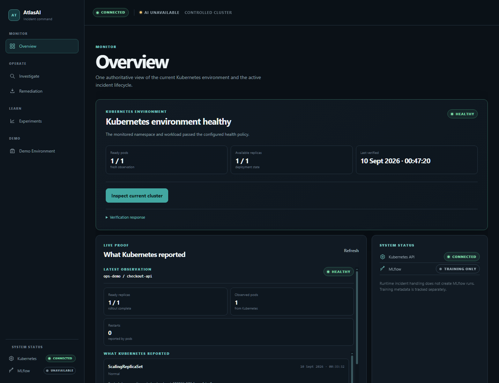
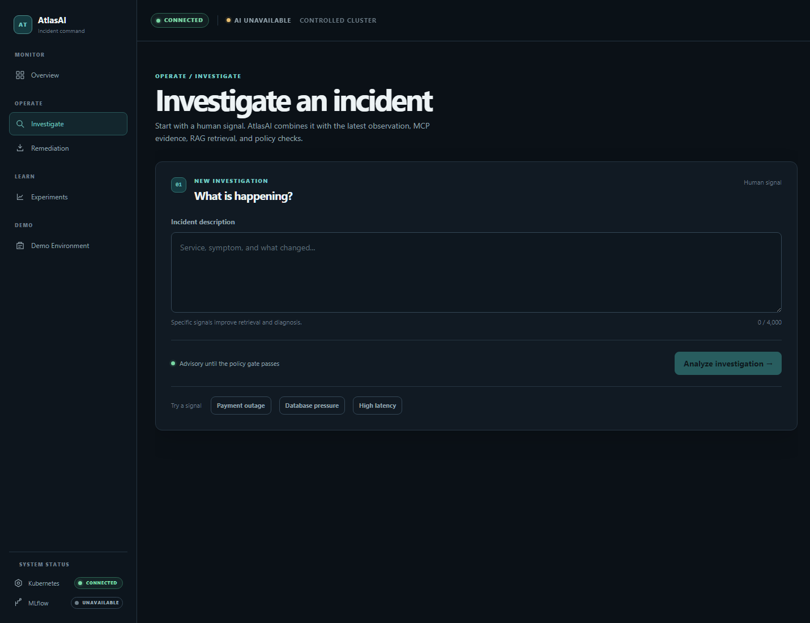
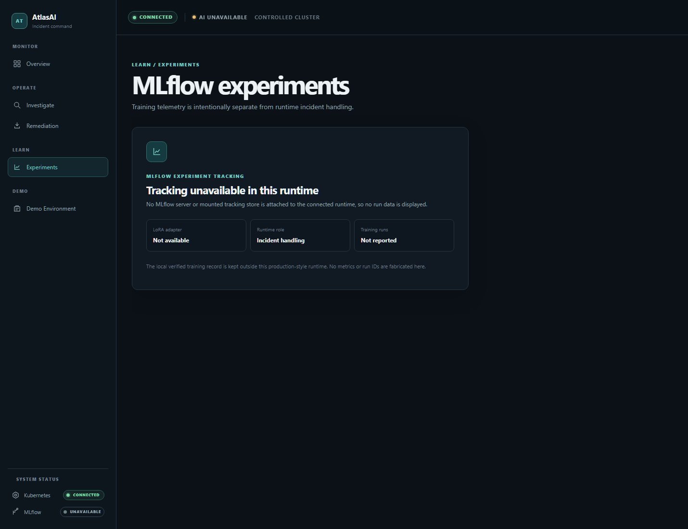
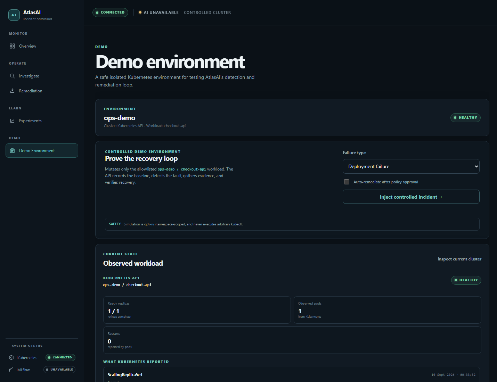

# AtlasAI

AtlasAI is an evidence-first incident response console for Kubernetes. An
operator describes a symptom, AtlasAI checks the live workload, retrieves
relevant operational knowledge, explains the likely cause, proposes a safe
action, and verifies the result with a fresh cluster observation.

The experience is designed to make the next SRE decision obvious without
hiding uncertainty: every status is tied to evidence, optional integrations
are labelled honestly, and remediation is restricted to an approved scope.

## See the console

  
  
  
  

## How one incident moves

1. **Detect** — A human signal or Kubernetes observation starts an
   investigation.
2. **Triage** — The classifier assigns an incident category and severity.
3. **Diagnose** — LangGraph coordinates the bounded analysis stages.
4. **Ground with evidence** — MCP reads the approved Kubernetes state,
   vector-ranked runbooks, and relevant history.
5. **Recommend** — AtlasAI ranks remediation options and shows confidence and
   supporting evidence.
6. **Safety gate** — Policy checks the target, action, evidence, and approval.
7. **Remediate** — The executor can restart one Pod, scale the Deployment to
   one replica, roll back the recorded healthy template, or clear a recorded
   temporary condition.
8. **Verify** — A fresh Kubernetes read must show healthy replicas, ready Pods,
   usable Service endpoints, and no failing health reasons.

If verification fails, the incident remains unresolved and the workflow can
return to diagnosis.

~~~mermaid
flowchart LR
    Signal[Human signal or Kubernetes event] --> Triage[Triage]
    Triage --> Diagnose[LangGraph diagnosis]
    Diagnose --> Evidence[MCP + RAG evidence]
    Evidence --> Recommend[Ranked recommendation]
    Recommend --> Gate[Safety and approval gate]
    Gate -->|approved| Remediate[Allowlisted remediation]
    Gate -->|wait| Explain[Explain and wait]
    Remediate --> Verify[Fresh Kubernetes observation]
    Verify -->|healthy| Resolved[Resolved with proof]
    Verify -->|unhealthy| Diagnose
~~~

## Architecture

~~~mermaid
flowchart LR
    Browser[Operator browser React + Vite] -->|HTTPS JSON| Frontend[Vercel static host]
    Frontend --> API[FastAPI API Cloud Run]
    API --> Queue[Bounded queue one active analysis]
    Queue --> Graph[LangGraph workflow]
    Graph --> Triage[Triage classifier LoRA or declared fallback]
    Graph --> RAG[Knowledge retrieval vector + lexical ranking]
    Graph --> Resolution[Resolution agent]
    RAG --> MCP[MCP tool boundary]
    MCP --> History[Incident history]
    MCP --> K8s[Kubernetes Python client]
    Policy[Safety policy] --> Remediation[Remediation agent]
    Graph --> Policy
    Remediation --> K8s
    K8s --> Verify[Fresh health verification]
    Train[Offline Python 3.11 training] -. validated artifact .-> Triage
    Train -. optional tracking .-> MLflow[MLflow]
~~~

| Layer | Technology | Purpose |
| --- | --- | --- |
| Interface | React 18, Vite, CSS | Single console with shared investigation state |
| API | FastAPI, Uvicorn, Pydantic | Typed request, job, and readiness boundaries |
| Workflow | LangGraph | Explicit detect, diagnose, evidence, gate, remediate, verify flow |
| Retrieval | PostgreSQL/pgvector plus lexical ranking | Relevant runbook and incident-history evidence |
| Tools | MCP server/client | Structured operational reads and bounded actions |
| Cluster | Kubernetes Python client | Real observations and approved Kubernetes API patches |
| Hosting | Vercel + Cloud Run | Static frontend plus scale-to-zero API |
| ML | Optional PEFT/LoRA classifier | Incident category prediction; fallback remains visible |
| Tracking | Optional MLflow training tracking | Offline experiment lineage, not runtime serving |

## Verified deployment

| Surface | Verified state |
| --- | --- |
| Local checks | 43 tests passed; Ruff and Python compilation passed; Vite production build passed |
| Kubernetes demo | Real connected GKE workload; controlled fault, approval-gated recovery, and fresh healthy **1 / 1** observation verified |
| Cloud Run API | [atlasai-330402458472.us-central1.run.app](https://atlasai-330402458472.us-central1.run.app) reports ready and reads the real **ops-demo/checkout-api** workload |
| Vercel frontend | [atlasai-tawny.vercel.app](https://atlasai-tawny.vercel.app) serves the AtlasAI console |
| Runtime posture | Cloud Run minimum instances **0**, maximum instances **1**; automatic remediation remains off |
| LoRA | Artifact validation is complete offline; the lightweight hosted image reports it unavailable and uses the declared fallback |
| MLflow | Optional for training; no hosted tracking server is claimed |

## Run locally

From the repository root:

~~~powershell
python -m venv .venv
.\.venv\Scripts\Activate.ps1
python -m pip install -r requirements-dev.txt
python -m uvicorn app.main:app --host 127.0.0.1 --port 8080
~~~

Open <http://127.0.0.1:8080>. The default local mode uses the memory
repository and simulated remediation.

To run the React development server separately:

~~~powershell
cd frontend
npm ci
$env:VITE_API_BASE_URL = 'http://127.0.0.1:8080'
npm run dev -- --host 127.0.0.1 --port 5173
~~~

## Deployment notes

The production-style topology is intentionally small:

- Vercel hosts the static React build.
- Cloud Run serves the FastAPI API with scale-to-zero and a one-instance cap.
- A VPC connector reaches the namespace-scoped GKE control plane.
- Kubernetes credentials are supplied through Secret Manager, never stored in
  source or the image.
- The hosted API uses a memory repository; durable PostgreSQL is a separate
  deployment option.

Before treating a new deployment as healthy, check /api/ready and perform a
real /api/cluster/summary read. Configuration alone is not proof of cluster
reachability.

## Training

The separate LoRA workflow, Python 3.11 package pins, Colab instructions,
artifact validation, and download steps are documented in
[training/COLAB.md](training/COLAB.md). Training is offline and never runs
during API startup.

## Safety

- Remediation is limited to **restart_pod**, **scale_deployment**,
  **rollback_deployment**, and **clear_temporary_condition**.
- Live actions require a connected observation, policy validation, and
  explicit approval.
- Retrieved runbook commands are reference evidence only; AtlasAI does not
  execute arbitrary shell or kubectl text.
- Secrets, model artifacts, MLflow stores, local kubeconfig files, and
  other local credentials remain outside Git.

## Development checks

~~~powershell
python -m pytest -q
python -m ruff check app training tests
python -m compileall -q app training
cd frontend
npm run build
~~~

The public console includes Overview, Investigate, Remediation, Experiments,
and Demo Environment views. Incident state and evidence remain shared across
those views.
