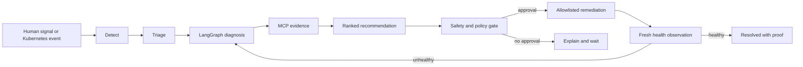
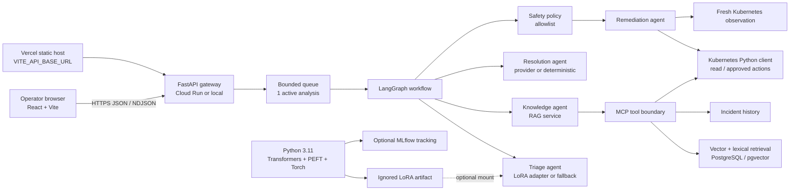

# AtlasAI

AtlasAI is a calm, evidence-first incident command console. A person reports
what they are seeing; AtlasAI checks the current service state, gathers useful
runbook and history evidence, proposes a bounded recovery, waits at the safety
gate, and verifies the result before it says the incident is resolved.

It is designed to be understandable in a walkthrough and honest in a real
deployment: every operational status comes from an observation, every
mutation is allowlisted, and optional AI or cloud integrations are labelled
when they are not connected.

## Console in four real views

<p align="center">
  
  
  
  
</p>

_These are real Edge browser captures at 1440 × 1100 from the deployed Vercel
site. The Overview and Demo views include a live connected Kubernetes
observation; the other views show the actual investigation and training-status
surfaces—not mockups._

## The story of one incident

1. **Detect** — A person submits a signal, or the Kubernetes detector notices
   an unhealthy workload.
2. **Triage** — The classifier assigns a category and severity. A validated
   LoRA adapter may do this; otherwise the console says that it is using the
   bounded deterministic fallback.
3. **Diagnose** — LangGraph moves the incident through the triage, knowledge,
   resolution, safety, and remediation steps.
4. **Collect evidence** — MCP tools read the approved Kubernetes observation,
   vector-ranked runbooks, and relevant incident history.
5. **Recommend** — AtlasAI ranks recovery actions and shows the evidence and
   confidence behind the recommendation.
6. **Gate** — Policy validation allows only four safe actions and requires
   approval for a live mutation. The default mode is simulation-only.
7. **Remediate** — An approved executor can restart one pod, scale a deployment
   to one replica, roll back the previous image, or clear a documented safe
   temporary condition.
8. **Verify** — A fresh Kubernetes observation must show recovery. If it does
   not, the workflow remains unresolved instead of claiming success.



## Architecture: what is connected to what



| Boundary | Technology | Responsibility |
| --- | --- | --- |
| Browser | React 18, Vite, CSS | One console with shared incident state |
| API | FastAPI, Uvicorn, Pydantic | Typed HTTP boundary and readiness status |
| Orchestration | LangGraph | Explicit detect → diagnose → evidence → gate → verify flow |
| Retrieval | PostgreSQL/pgvector plus deterministic embeddings | Ranked runbook and history evidence |
| Tool boundary | MCP server/client | Structured reads and four safe action calls |
| Cluster | Kubernetes Python client | Real observations and approved Kubernetes API patches |
| Classifier | Optional PEFT/LoRA adapter | Six-category incident classification; fallback is declared |
| Training | Python 3.11, Transformers, PEFT, Torch | Separate offline training/evaluation process |
| Deployment | Cloud Run | Scale-to-zero, one instance maximum, one active analysis slot |
| Frontend hosting | Vercel | Static frontend calling the API through `VITE_API_BASE_URL` |

## What is verified today

| Area | Status | Evidence |
| --- | --- | --- |
| Local UI | **Verified** | Production Vite build and browser screenshot |
| Automated checks | **Verified** | `38 passed`; Ruff, compile, and diff checks pass |
| Kubernetes demo | **Verified locally** | Real baseline → injected fault → approved rollback → fresh healthy `1/1` observation |
| MCP / RAG flow | **Verified locally** | Tool calls and retrieval details are exposed in the result view |
| LoRA artifact | **Validated** | Label map, metadata, checksums, manifest, and held-out metrics pass validation |
| LoRA runtime inference | **Unavailable in the lightweight image** | Torch/Transformers/PEFT and the ignored artifact are intentionally not packaged there |
| MLflow server | **Not connected** | The UI does not invent run IDs or metrics |
| Cloud Run + hosted Kubernetes | **Verified** | [`atlasai-330402458472.us-central1.run.app`](https://atlasai-330402458472.us-central1.run.app) returns `status: ready`; `/api/cluster/summary` reports the real GKE `ops-demo/checkout-api` workload connected and healthy (`1/1`) |
| Vercel frontend | **Verified** | [`atlasai-tawny.vercel.app`](https://atlasai-tawny.vercel.app) serves the AtlasAI UI and embeds the Cloud Run API URL |
| Secret-backed Cloud Run pipeline | **Partial** | Image build is verified; declarative deploy still needs the two Secret Manager versions named in `cloudbuild.yaml` |

The validated educational adapter reports 0.583 accuracy and 0.603 macro-F1
on 24 held-out examples. Those numbers are not production-quality evidence.

## Run locally

### API and UI together

```powershell
python -m venv .venv
.\.venv\Scripts\Activate.ps1
python -m pip install -r requirements-dev.txt
python -m uvicorn app.main:app --host 127.0.0.1 --port 8080
```

Open <http://127.0.0.1:8080>. This mode uses the memory repository and keeps
remediation simulated unless explicitly configured otherwise.

For the React development server:

```powershell
cd frontend
npm ci
$env:VITE_API_BASE_URL = 'http://127.0.0.1:8080'
npm run dev -- --host 127.0.0.1 --port 5173
```

The separate frontend requires the API to allow its origin. Set
`OPSPILOT_CORS_ORIGINS=http://127.0.0.1:5173` on the API when using this mode.

### Real local Kubernetes proof

The verified demo uses the protected `ops-demo/checkout-api` workload and an
approved kubeconfig. The API must run with:

```powershell
$env:OPSPILOT_KUBERNETES_MODE = 'execute'
$env:OPSPILOT_REMEDIATION_MODE = 'execute'
$env:OPSPILOT_AUTO_REMEDIATION = 'false'
```

The Demo Environment page then permits a controlled injection. Approval is
still required before a live action.

## Cloud Run deployment

The verified demo service is configured for cost-controlled single-instance
operation and a real, namespace-scoped GKE connection:

- minimum instances: `0`
- maximum instances: `1`
- one active analysis slot and queue capacity of one
- VPC connector: `atlasai-connector` with private-range egress to the GKE
  control plane
- Kubernetes token and CA are injected from Secret Manager; they are not in
  the image or repository
- `OPSPILOT_KUBERNETES_MODE=execute`, while automatic remediation remains off
  and every live action still requires an explicit approval

Live demo URL: <https://atlasai-330402458472.us-central1.run.app>. It uses the
memory repository (so incident history is ephemeral), but its Kubernetes
observation boundary is real and secret-backed. Its `/api/ready` and
`/api/cluster/summary` responses are the source of truth for that posture.

After enabling billing, Artifact Registry, Cloud Build, Secret Manager, and
Cloud Run in the selected Google Cloud project, create the two secrets named
in `cloudrun/service.yaml`, then run:

```powershell
$env:CLOUDSDK_PYTHON = 'C:\Users\admin\AppData\Local\Programs\Python\Python311\python.exe'
$tag = git rev-parse --short HEAD
gcloud builds submit --config cloudbuild.yaml --substitutions=_IMAGE_TAG=$tag
```

The command below is the production-oriented pipeline. It expects the two
Secret Manager versions named in `cloudrun/service.yaml`; the verified demo
was deployed separately with the safe environment above. Do not call a new
deployment successful until
`gcloud run services describe atlasai --region us-central1` returns a URL and
`/api/ready` returns `status: ready`.

## Vercel frontend deployment

The root `vercel.json` builds `frontend/` and publishes the generated `static/`
directory. In the Vercel project settings, add:

```text
VITE_API_BASE_URL=https://<verified-cloud-run-url>
```

Then deploy from the repository root:

```powershell
vercel --prod
```

The verified project is live at <https://atlasai-tawny.vercel.app>. Its
`VITE_API_BASE_URL` points to the demo URL above, and Cloud Run allows that
origin through `OPSPILOT_CORS_ORIGINS`. Verify the browser can load
`/api/ready`, inspect the cluster status, and submit an analysis before
sharing a new deployment URL.

## Training and LoRA

Training is deliberately separate from serving. The exact Python 3.11
requirements, Colab flow, validation gate, and download instructions are in
[`training/COLAB.md`](training/COLAB.md). The adapter directory is ignored by
Git. Runtime startup validates its label map, metadata, model checksum, and
manifest before it can be selected; inference failure falls back visibly and
never fabricates a LoRA result.

## Safety boundaries

- No arbitrary shell or `kubectl` command is executed by remediation.
- Only `restart_pod`, `scale_deployment`, `rollback_deployment`, and
  `clear_temporary_condition` are allowlisted.
- Live actions require a connected observation, policy validation, and explicit
  approval.
- Compose remains simulation/read-only by default. The hosted Cloud Run demo
  has an execute-capable Kubernetes client, but automatic remediation is off
  and live changes remain approval-gated.
- Secrets, model weights, `docs/`, MLflow stores, and local kubeconfig files
  stay out of Git.

## Development checks

```powershell
python -m pytest -q
python -m ruff check app training tests
python -m compileall -q app training
cd frontend; npm run build
```

The public UI has Overview, Investigate, Remediation, Experiments, and Demo
Environment views. Incident state and evidence stay shared across those views;
there is intentionally no separate Incident History page.
